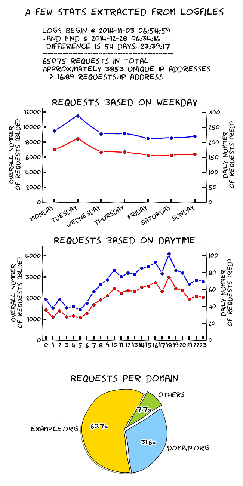

makelog
=======

Creates nice (and rather useless) graphs from lighttpd/apache/etc access-logs

## Requirements/Setup

- The makelog-script from this repository
- Python3
- Paramiko for python3 if you use the --update-function
- Matplotlib for python3 to generate graphs

## Usage

- -h, --help → Shows the help
- -v, --verbose → Show debug messages
- -u, --update → Download logfiles from remote (server)
- -p, --process → Process new logfiles
- --rebuild → Rebuild stats-table from ground
- -s, --stats → Calculate stats and show output
- -e, --export → Export nice, generated image

## Example

